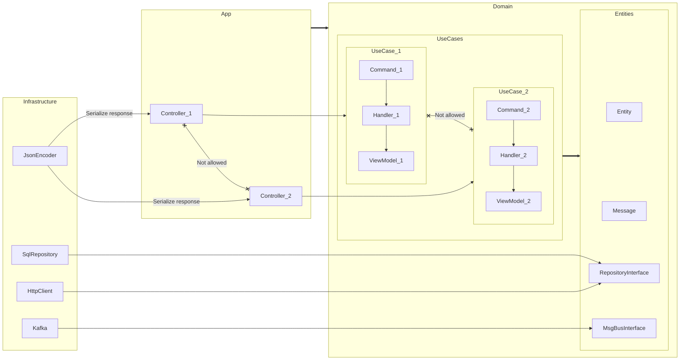

## Запуск

* `docker compose up -d` (create `compose.override.yml`)
* `docker exec -i -t blog-php bash`
* `composer i`
* `php bin/console doctrine:migrations:migrate`

## Тест

`composer quality`

## Пользователи

Создать пользователя:

`php bin/console user:create email password`

Форма входа: `/login`

## Слои

`App\Symfony` -> `App\Infrastructure` -> `App\Domain`

* `App\Symfony` Ввод/Вывод
* `App\Infrastructure` Реализация интерфейсов и вспомогательные компоненты
* `App\Domain` Доменная область (Entities + UseCases)

