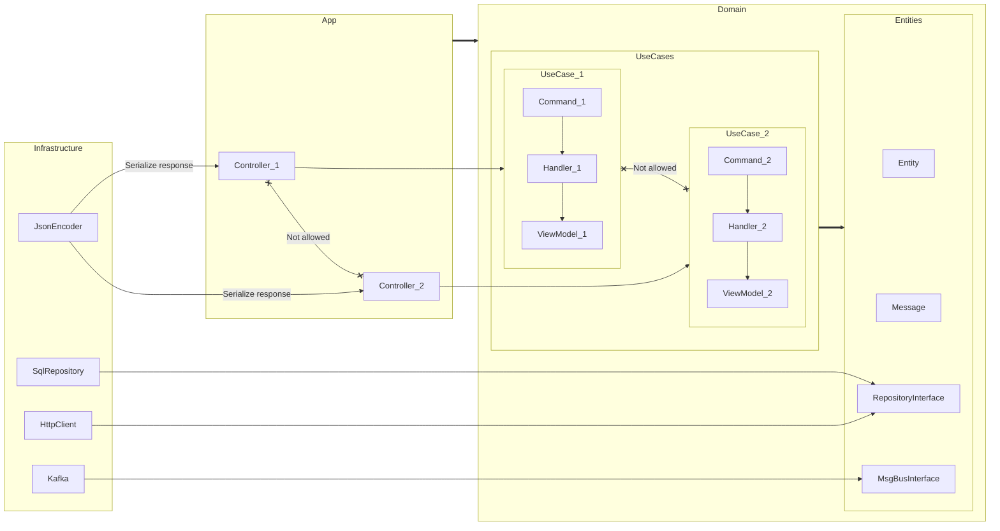

## Слои

`App\Symfony` -> `App\Infrastructure` -> `App\Domain`

* `App\Symfony` Ввод/Вывод
* `App\Infrastructure` Реализация интерфейсов и вспомогательные компоненты
* `App\Domain` Доменная область (Entities + UseCases)

